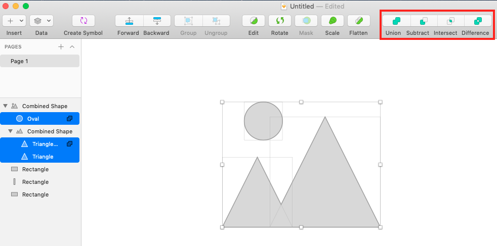
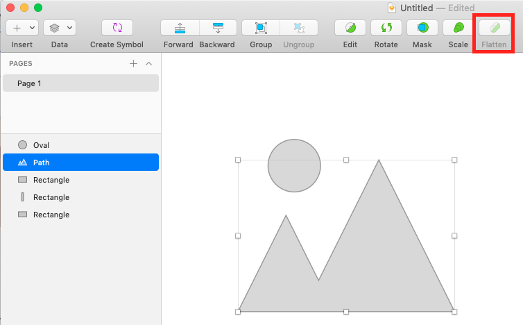

## [edwith] 3일 만에 배우는 Sketch

[3일 만에 배우는 Sketch](https://www.edwith.org/cdc_sketch/) 수강

## 기본

### 스케치 툴 바 세팅

툴바 우클릭 > 커스터마이즈 툴 바 > 원하는 기능 drag > 툴 바에 추가

### 도형 그리기

* 상단 메뉴바의 insert > shape에서 확인 가능
* 단축키
  * `O`: Oval
  * `R`: Rectangle
  * `U`: Rounded
  * `L`: Line

### 도형 합치고, 빼기

* 일러스트레이터와 마찬가지로 도형을 합치거나 빼는 기능이 있다

* Union, Subtract, Intersect, Difference가 있고 합쳐지기 이전 도형이 레이어에서 확인 가능하며 더블클릭해 세밀한 점을 수정할 수도 있다

  

* 상단 툴바의 Flatten 기능으로 각개로 존재하는 도형을 하나의 도형으로 만들 수 있다

  

### 이미지 넣기

1. 툴 바 이미지 메뉴 > 이미지 삽입
   - 이미지 크기 조절시, 기본 도형 비율대로 이미지 변형

2. 도형에 이미지 채우기

   - 사각형 도형 그리기 > 오른쪽 패널 Fill 기능 선택 > Fill > Choose image 
- 도형 사이즈 변경에 맞춰 이미지 변형
  
3. 원하는 도형에 이미지 마스크 씌우기
   - 도형 그리기, 이미지 삽입하기 > 도형과 이미지 선택 > 우클릭 마스크 씌우기
   - 마스크된 이미지의 위치 조정 가능

## 디자인 요소 효율적으로 관리하기

### 레이어 관리하기

* 폴더 안에 추출하기
  * 레이어명에 슬러시(`/`)를 추가하면 이미지를 추출할 때 자동으로 해당 레이어 명 폴더가 생성됨. 예를들어 `img/imgs` 레이어를 추출하면 `img` 폴더 안에 `imgs` 레이어가 추출됨
* 레이어 추출하기
  * 방법1. 레이어 선택 후 오른쪽 패널에서 Make exportable / Export artboard 클릭
  * 방법2. 오른쪽 패널에서 레이어 선택 후 바탕화면으로 drag
* 관련 단축키 
  - `cmd + G`: 스타일 등록하기
  - `cmd + alt + 화살표(위/아래)`: 레이어 여러개 이동하기

### 스타일 지정 및 관리

스케치는 디자인을 모듈화 시키는것이 가능하다. hover, active와 같은 스타일은 물론이고 객체의 dropshadow 등 반복적으로 사용되는 효과의 스타일을 저장해 반복해 사용할 수 있다

* 스타일 등록하기
  * 효과 주기(반복되는 효과) > 오른쪽 패널의 No shared style > Create new shared style > 스타일명 지정
* 등록한 스타일 적용하기
  * No shared style > 적용할 스타일명 클릭
* 등록한 스타일 수정하기
  * 수정할 스타일 선택 > 효과 수정 > 해당 스타일에 덮어씌우기 (Update layer style) 
  * 다른 레이어에 적용된 스타일도 한꺼번에 수정 가능

### 심볼 지정 및 관리

반복적으로 사용되는 디자인 (콤포넌트는 물론 아이콘)을 심볼로 지정해 관리할 수 있다.

* 심볼 등록하기: 다른 화면에서도 사용할 컨텐츠 선택 > 툴 바 Create symbol 클릭 > 심볼명 입력 > 등록 후 레이어 아이콘 변경
* 심볼 수정하기: 심볼 더블 클랙 > 수정 > Return to instance

## 플러그인 활용하기

개발자들이 만들어 디자인 생산성을 높여주는 부가 기능들

### 관리 및 설치

메뉴바의 Plugin > manage plugins, Get Plugins로 새로운 플러그인 설치 가능

### Zeplin으로 디자인 가이드 만들기

* 제플린 플러그인 설치

  제플린 프로젝트 생성하기 > 오른쪽 패널 - 프로젝트명 설정 > 해상도 설정

* 스케치 화면을 제플린으로 export 하기

  스케치 레이어 선택 > `cmd + E` 제플린으로 프로젝트 이동 > import 클릭 > 자동으로 디자인 가이드 생성 - 우측 패널에서 프로젝트 멤버 초대 가능

* 제플린에서 코멘트 달기

  상세 화면 페이지 > 우측 하단 Notes 클릭 > 코멘트 추가

* 스케치와 제플린을 활용하여 아이콘 사이즈별로 저장하기

  원하는 아이콘 그룹 선택 > 우측 패널 하단 `make exportable` > Slice > 생성된 Slice 레이어를 그룹 안으로 이동 > Export group contents only 체크(배경없이 export하기 위함) > Import 제플린으로 이동 > 오른쪽 패널에서 사이즈별 아이콘으로 다운로드 가능

* 제플린 태그 기능 활용하기

  상세 화면 페이지 > 오른쪽 패널 태그 - Manage > 태그명 생성 > Dashboard 상단에 태그 생성됨 > 클릭시 태그 설정된 페이지만 모아서 볼 수 있음. 

  화면이 많을 때 프로젝트 관리하기 용이함

* 제플린 개별 화면 공유

  상세화면 페이지 > 오른쪽 패널 링크 클릭 > Copy and ling 웹 화면으로 공유 가능

### Invision craft 사용하기

* 인비전 크래프트 다운로드 및 실행

* 인비전 크래프트 퐐용하여 랜덤 이미지 삽입하기

  이미지를 넣을 도형 선택 > 오른쪽 패널 이미지 아이콘 클릭 > Custom - photo 선택 > Folder, Dropbox, Unsplash등 원하는 곳을 선택하여 임의의 이미지 삽입

* 인비전 크래프트 활용하여 더미 텍스트 삽입하기

  원하는 텍스트 선택 > 오른쪽 패널 Dupicate Content 클릭 > Custom - type 선택 > 원하는 유형 선택

### Invision Design System Manager 사용하기

* 인비전 설치시 자동으로 설치
* Colors, Text Styles, Icons, Components, Fonts 스타일 가이드 정의 가능
* 프로젝트 멤버 초대 가능
* 버전 픽스 기능