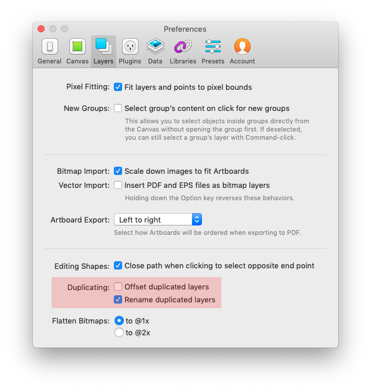

# 레이어 복제시 자동으로 붙는 "Copy" 해제하기

스케치에서 레이어를 복제하면 자동으로 해당 레이어명 뒤에 "Copy"라는 이름이 붙는다. Override를 위한 텍스트를 Label 이라 명명해둔 경우 복사된 레이어마다 Copy라는 이름을 하나하나 제거해 줘야 하는 경우가 생긴다 (Rename it으로 쉽게 고칠 수도 있겠다.) 이런 작업을 방지하기 위해 Copy라고 자동으로 붙는 기능을 비활성화 시킬 수 있다.

```
Sketch > Preference > Layers
```

Preference는 `cmd + ,` 로도 열 수 있다.

Layers 탭의 Duplicating: [ x ] Rename Duplicated Layers를 체크 해제해주면 간단하게 해결된다.

