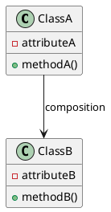

클래스 다이어그램은 소프트웨어 개발에서 중요한 도구이며, 시스템의 구조와 관계를 시각적으로 표현하는 데 사용됩니다. 이는 개발자들이 코드를 이해하고 유지보수하는 데 도움을 주는 강력한 도구입니다. 

Python은 클래스 다이어그램을 만들고 자동화하는 다양한 도구와 라이브러리를 제공합니다. 이 글에서는 몇 가지 흔히 사용되는 도구와 방법을 살펴보겠습니다.

## 1. Pyreverse

Pyreverse는 **Pylint**라이브러리의 일부로 제공되는 도구로, 소스 코드로부터 클래스 다이어그램을 생성하는 데 사용됩니다. 다음 명령을 사용하여 Pyreverse를 설치할 수 있습니다:

```
$ pip install pylint
```

Pyreverse를 사용하여 다이어그램을 생성하려면 다음과 같은 명령을 실행합니다:

```
$ pyreverse [options] [파일 또는 디렉토리 경로]
```

다음은 Pyreverse를 사용하여 `example.py` 파일로부터 클래스 다이어그램을 생성하는 예제입니다:

\```python
$ pyreverse example.py
\```

위의 명령을 실행하면 다이어그램을 `classes.dot` 및 `packages.dot` 파일로 생성합니다. 이 파일들은 Graphviz 도구를 사용하여 다이어그램을 PNG, PDF 또는 SVG 형식으로 변환할 수 있습니다.

## 2. PlantUML

PlantUML은 텍스트 기반으로 UML 다이어그램을 작성할 수 있는 도구입니다. 다음과 같은 PlantUML 코드를 사용하여 클래스 다이어그램을 작성할 수 있습니다:



PlantUML 코드를 작성한 후 `plantuml.jar` 파일을 사용하여 다이어그램을 생성할 수 있습니다. 다음 명령을 사용하여 PlantUML을 설치하고 다이어그램을 생성합니다:

```
$ java -jar plantuml.jar [파일명].txt
```

위의 명령을 실행하면 다이어그램을 PNG 또는 SVG로 출력하는 이미지 파일이 생성됩니다.

## 3. Jupyter Notebook

Jupyter Notebook은 데이터 분석과 시각화에 널리 사용되는 도구입니다. 이를 활용하여 클래스 다이어그램을 작성하고, 코드와 함께 실행 결과를 바로 확인할 수 있습니다. 다음은 Jupyter Notebook에서 클래스 다이어그램을 그리기 위한 예제 코드입니다:

```python
import matplotlib.pyplot as plt
import networkx as nx

G = nx.DiGraph()
G.add_node("ClassA")
G.add_node("ClassB")
G.add_edge("ClassA", "ClassB", label="composition")

pos = nx.spring_layout(G)
nx.draw_networkx(G, pos, with_labels=True)
labels = nx.get_edge_attributes(G, 'label')
nx.draw_networkx_edge_labels(G, pos, edge_labels=labels)
plt.show()
```

위의 코드를 실행하면 Jupyter Notebook에서 클래스 다이어그램이 그려집니다.

## 자동화

다이어그램 생성은 많은 시간과 노력을 필요로 할 수 있습니다. 따라서 Python에서는 자동화를 통해 소스 코드로부터 자동으로 클래스 다이어그램을 생성하는 방법을 제공합니다.

자동화를 위해 사용할 수 있는 몇 가지 라이브러리는 다음과 같습니다:

- **Sphinx**: `sphinx-apidoc` 명령을 사용하여 소스 코드의 API 문서를 작성하고, `sphinx-build` 명령을 사용하여 클래스 다이어그램을 생성할 수 있습니다.
- **Doxygen**: Doxygen은 C++, C, Objective-C, Java, Python 등 다양한 프로그래밍 언어의 소스 코드로부터 자동으로 문서를 생성하는 도구입니다. 클래스 다이어그램도 Doxygen을 통해 생성할 수 있습니다.

이처럼 다양한 도구와 라이브러리를 활용하여 클래스 다이어그램을 만들고 자동화하는 것은 개발 생산성을 높이고 코드 이해를 돕는 데 큰 도움이 됩니다.

이 글에서는 파이썬에서 클래스 다이어그램을 만들고 자동화하는 몇 가지 방법을 살펴보았습니다. 다양한 도구와 라이브러리를 사용하여 개발 과정을 더욱 효율적으로 관리하고, 코드의 이해와 유지보수를 용이하게 할 수 있습니다.