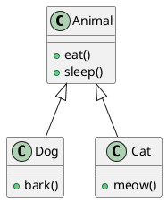

클래스 다이어그램은 클래스와 클래스 간의 상속 관계를 나타내는데 사용됩니다. 상속 관계는 화살표로 표현되며, 상위 클래스(부모 클래스)에서 하위 클래스(자식 클래스)로 화살표가 향하게 됩니다. 이러한 다이어그램은 각 클래스의 이름과 함께 표시됩니다.

다음은 UML 클래스 다이어그램의 예시입니다:

위의 예시에서 Animal 클래스는 Dog 클래스와 Cat 클래스를 상속하고 있습니다. 이를 UML의 클래스 다이어그램으로 표현하면 Animal 클래스 밑에 Dog 클래스와 Cat 클래스를 그림으로 나타낼 수 있습니다. 이렇게하면 클래스 간의 상속 계층 구조를 시각적으로 파악할 수 있습니다.

참고 자료:
- [UML Wikipedia](https://en.wikipedia.org/wiki/Unified_Modeling_Language)
- [UML Tutorial](https://www.tutorialspoint.com/uml/index.htm)

#TechBlog #UML