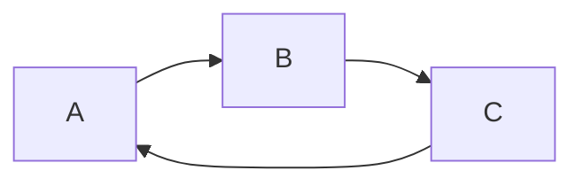
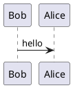

### Mermaid
Mermaid는 간단한 DSL(Domain Specific Language)을 이용하여 시퀀스 다이어그램, 플로우차트, 클래스 다이어그램 등 다양한 도표를 그릴 수 있습니다.

먼저, Mermaid를 설치합니다. 

```bash
npm install mermaid
```

Marked와 함께 Mermaid를 사용하기 위해서는 아래와 같이 옵션을 설정해야 합니다.

```javascript
const marked = require('marked');
const mermaid = require('mermaid');

// Mermaid 설정
mermaid.initialize({
  startOnLoad: true,
});

// 마크다운 변환기 생성
const renderer = new marked.Renderer();

// 코드 블록을 파싱하여 Mermaid 도표로 변경
renderer.code = (code, language) => {
  if (language === 'mermaid') {
    return `<div class="mermaid">${code}</div>`;
  } else {
    // 다른 언어의 코드는 일반적인 방식으로 변환
    return `<pre><code class="${language}">${code}</code></pre>`;
  }
};

// 변환기에 렌더러 등록
marked.setOptions({
  renderer: renderer,
});

// 파일을 읽어서 변환
const markdown = fs.readFileSync('example.md', 'utf8');
const html = marked(markdown);

// HTML 출력
console.log(html);
```

이제 마크다운에서 Mermaid 도표를 그릴 수 있습니다.

```markdown

```
위와 같이 마크다운 코드 블록 안의 언어를 `mermaid`로 설정하고 도표를 작성하면, Marked와 함께 실행하면 됩니다.

### PlantUML
PlantUML은 간단한 텍스트 기반 언어를 이용하여 시퀀스 다이어그램, 유스케이스 다이어그램 등 다양한 도표를 그릴 수 있는 도구입니다.

먼저, PlantUML을 설치합니다.

```bash
npm install -g @plantuml/webpack-loader
```

Marked와 함께 PlantUML을 사용하기 위해서는 아래와 같이 옵션을 설정해야 합니다.

```javascript
const marked = require('marked');
const plantuml = require('@plantuml/webpack-loader');

// PlantUML 설정
plantuml.setup('./')

// 마크다운 변환기 생성
const renderer = new marked.Renderer();

// 코드 블록을 파싱하여 PlantUML 도표로 변경
renderer.code = (code, language) => {
  if (language === 'plantuml') {
    return `<div class="plantuml" data-uml="${code}"></div>`;
  } else {
    // 다른 언어의 코드는 일반적인 방식으로 변환
    return `<pre><code class="${language}">${code}</code></pre>`;
  }
};

// 변환기에 렌더러 등록
marked.setOptions({
  renderer: renderer,
});

// 파일을 읽어서 변환
const markdown = fs.readFileSync('example.md', 'utf8');
const html = marked(markdown);

// HTML 출력
console.log(html);
```

이제 마크다운에서 PlantUML 도표를 그릴 수 있습니다.

```markdown

```

위와 같이 마크다운 코드 블록 안의 언어를 `plantuml`로 설정하고 도표를 작성하면, Marked와 함께 실행하면 됩니다.

Mermaid와 PlantUML은 각각 다양한 종류의 도표를 지원하고 있으며, 자세한 사용법은 공식 문서를 참고하시기 바랍니다.
- Mermaid 문서: [https://mermaid-js.github.io/mermaid/#/](https://mermaid-js.github.io/mermaid/#/)
- PlantUML 문서: [http://plantuml.com/](http://plantuml.com/)