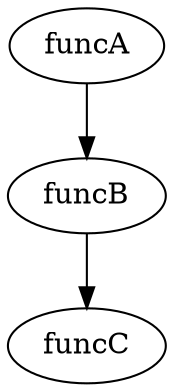

C++ 프로그램에서 함수 간의 의존성을 이해하는 것은 프로그램을 이해하고 유지 보수하는 데 중요합니다. 함수의 이해 관계도를 시각적으로 나타내는 것은 이러한 의존성을 파악하는 데 도움이 됩니다. 

이 포스트에서는 C++ 함수의 이해 관계도를 생성하고 시각화하는 방법에 대해 설명합니다.

## 함수 의존성 이해

C++ 프로그램에서 함수 간의 의존성은 하나의 함수가 다른 함수를 호출하는 경우에 나타납니다. 이러한 호출 관계를 분석하여 함수 간의 의존성을 이해할 수 있습니다.

## 함수 의존성을 표현하는 그래프

의존성 그래프는 함수 간의 호출 관계를 시각적으로 나타낸 그래프입니다. 이 그래프를 통해 프로그램의 전반적인 구조와 함수 간의 관계를 파악할 수 있습니다. 

아래는 함수 의존성을 표현하는 간단한 예제 코드입니다.

```c++
void funcA() {
    funcB();
}

void funcB() {
    funcC();
}

void funcC() {
    // do something
}

int main() {
    funcA();
    return 0;
}
```

위의 코드에서 `funcA`는 `funcB`를 호출하고, `funcB`는 `funcC`를 호출합니다. 따라서 `funcA`는 `funcB`와 `funcC`에 의존성이 있습니다. 

## 함수 의존성 그래프 생성

의존성 그래프를 생성하기 위해 다양한 도구와 라이브러리가 있습니다. 이 중에서 `clang`과 `Graphviz` 를 사용하여 함수 의존성 그래프를 생성할 수 있습니다.

아래는 `clang`을 사용하여 함수의 호출 관계를 추출하는 명령어의 예제입니다.

```bash
clang -Xclang -ast-dump -fsyntax-only your_file.cpp
```

이 명령은 C++ 소스코드를 파싱하여 함수 간의 호출 관계를 추출합니다.

## 그래프 시각화

`Graphviz`를 사용하면 추출된 함수 의존성을 시각적인 그래프로 표현할 수 있습니다. 

다음은 `Graphviz`의 DOT 언어를 사용하여 함수 의존성 그래프를 그리는 간단한 예제입니다.



`dot` 파일에 함수 간의 호출 관계를 표현한 후, `Graphviz`의 도구를 사용하여 그래프 이미지를 생성할 수 있습니다.

## 마치며

함수의 의존성을 시각적으로 나타내는 그래프를 통해 프로그램의 구조와 함수 간의 관계를 파악할 수 있습니다. 이를 통해 프로그램을 이해하고 유지보수하는 데 도움이 될 것입니다.

이상으로 C++ 함수의 이해 관계도에 대한 포스트를 마칩니다. 감사합니다.

## 참고 문헌
- Duncan, T. (2019). *C++ Best Practices*. O'Reilly Media.