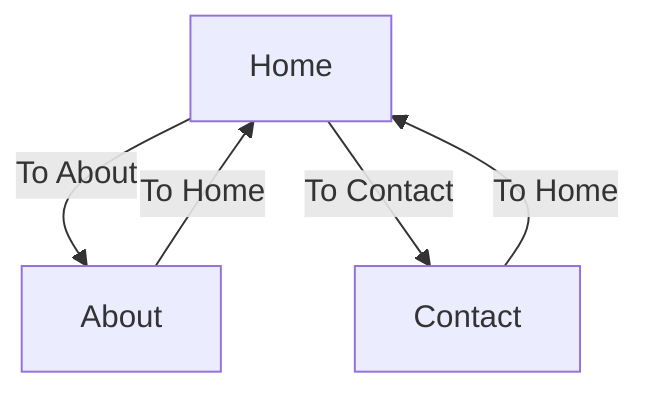

Vue Router는 Vue.js 애플리케이션의 뷰 관계를 관리하는 라이브러리이며, 라우팅 및 네비게이션을 구현하는 데 사용됩니다. 

다음은 Vue Router의 뷰 관계를 보여주는 간단한 다이어그램입니다.

위 다이어그램은 세 가지 컴포넌트 간의 관계를 보여줍니다.
- "Home"에서 "About"과 "Contact"로 이동할 수 있습니다.
- "About"과 "Contact"에서 다시 "Home"으로 이동할 수 있습니다.

Vue Router를 사용하여 뷰 관계를 관리하는 데 도움이 되는 다이어그램입니다.

더 많은 정보를 원하시면 [Vue Router 공식 문서](https://router.vuejs.org/)를 참고하세요.